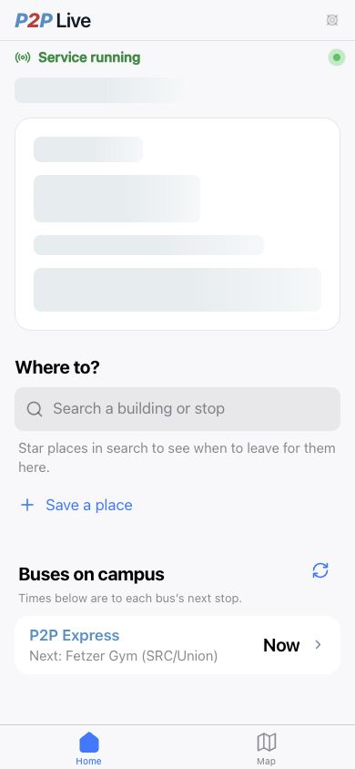
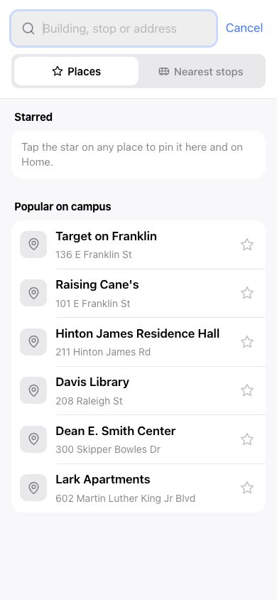

# P2P Live

**Your phone-first guide to getting around UNC Chapel Hill.**

P2P Live brings UNC P2P transit information into a simple experience built first for your phone. Check active buses and arrival estimates, find nearby stops, read service notices, and look up popular campus and Chapel Hill destinations—whether you are walking to class or heading across town.

> P2P Live is designed for use on and near the UNC Chapel Hill campus. Live vehicle and arrival information depends on the availability of the transit data feed.

## See it in action

### Check campus transit at a glance

The **Home** screen puts service status, bus times, and your next destination search in one place. See when a bus reaches its next stop, refresh the latest available times, and start a search without leaving the screen.



### Search and save the places you use

Tap **Where to?** to search a building, stop, or address. Browse popular campus destinations, switch to nearby stops, and star the places you use most so they stay easy to reach from Home.



## For riders

P2P Live is designed for quick, one-handed use. Use the bottom navigation to switch between the essentials:

1. **Home** — See service status and buses on campus. Tap **Where to?** to search a building or stop, or use the refresh control for the latest bus times.
2. **Map** — Explore bus positions, stops, and routes visually. Tap a bus or stop to see more information.

P2P Live may ask for your location so it can highlight the closest stop and make trip plans more useful. If you decline, the app still works and starts from the UNC Student Union area.

### Helpful details

- Service notices appear at the top of the app when they are available.
- Arrival information is labeled when it comes from a schedule instead of the live feed.
- Starred places are saved in your browser so your most-used destinations stay close at hand.

## Run locally

**Prerequisite:** Node.js

1. Install dependencies: `npm install`
2. Copy [.env.example](.env.example) to `.env.local` and set `VITE_MAPBOX_TOKEN`, `MAPBOX_TOKEN`, and `GMV_RTPI_API_KEY`. The Vite frontend and Node API both read `.env.local` in local development. Never commit real keys.
3. Start the public rider app and its API in separate terminals:
   - `npm run dev` starts Vite on <http://localhost:3000>.
   - `npm run server` starts the GMV and Mapbox API on port 3001.
4. Open <http://localhost:3000>.

There is no `dev:all` script. Use the two commands above so each process stays independently visible and easy to stop.

## Data and privacy

Live transit information is supplied through the GMV Syncromatics RTPI API. P2P Live uses it for bus positions, ETAs, stops, route lines, and service messages. The server keeps this data only in memory and does not persist it beyond the provider's permitted retention period. Location is used in the browser to personalize nearby-stop and search results.

## Development checks

```bash
npm run typecheck
npm test
npm run build
```

The existing Tailwind theme is compiled at build time; local development and
production no longer require the Tailwind CDN script. Mapbox loads when opening
the map. See [mobile performance measurements and reproduction steps](docs/performance.md)
for the before/after benchmarks and the local simulated-data harness.
